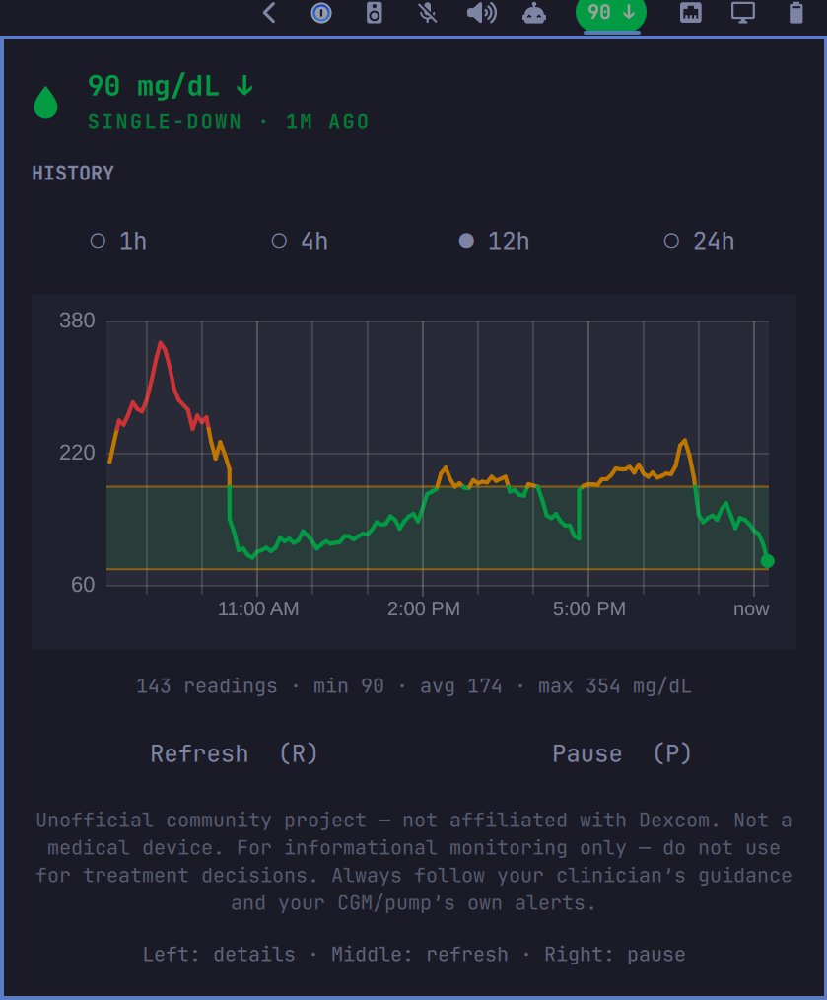
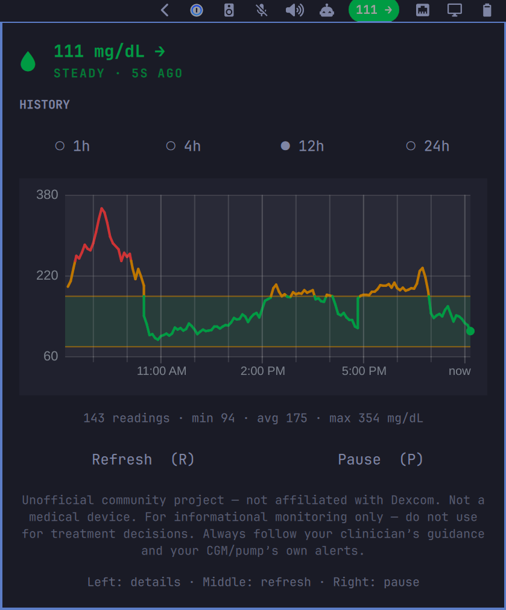
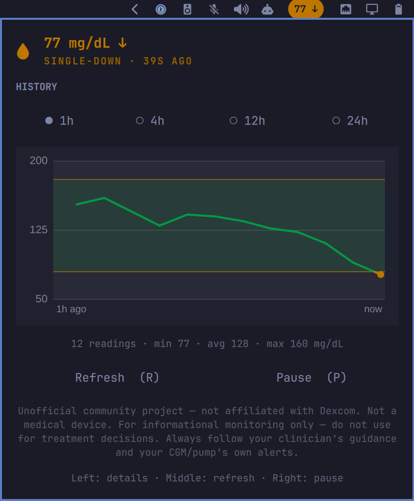

# Dexcom Share for Omarchy (unofficial)

See your, or your loved one’s, **Dexcom Share** CGM readings on your Omarchy desktop bar — live reading, trend arrow, and a simple history chart.

This is a **community project for those with Type 1 diabetes, their caregivers, and/or followers** who already use Dexcom Share. It is **not** made by Dexcom, **not** a medical device, and **not** for treatment decisions.

Best-effort community visibility on the desktop — not a Dexcom product, not affiliated with Dexcom, and not meant to compete with or harm Dexcom in any way.







## Before you start

You need:

1. **Omarchy** already installed and working on your computer
2. A **Dexcom Share** login that can already see the readings in the official Share / Follow apps
3. About five minutes

You do **not** need to be a programmer or even computer savvy to use this!

## Install (three steps)

### 1. Add the plugin

Open a terminal and run:

```sh
omarchy plugin add https://github.com/Fail-Safe/omarchy-dexcom.git --enable
```

That downloads the widget and puts it on your Omarchy bar.

### 2. Create your Share login file

Still in the terminal:

```sh
cp ~/.config/omarchy/plugins/failsafe.dexcom/dexcom-share.example.json ~/.config/omarchy/dexcom-share.json
chmod 600 ~/.config/omarchy/dexcom-share.json
```

Then open this file in any text editor:

`~/.config/omarchy/dexcom-share.json`

It looks like below. Don't feel overwhelmed by the curly braces (sometimes referred to as 'moustaches'). Simply replace the example values that begin with 'your-dexcom-...' with **your Dexcom Share username and password**:

```json
{
  "accountName": "your-dexcom-share-username",
  "password": "your-dexcom-share-password",
  "region": "us"
}
```

- Use the same Share login you use to follow readings
- Set `"region"` to `"us"` if you are in the United States, or `"ous"` if you are outside the US
- Save the file
- Leave the file permissions alone (`chmod 600` keeps it private to you)

### 3. Wait a moment

Within about a minute, the bar should show a glucose number and trend arrow (for example `111 →` or `90 ↓`).

If it still says offline or shows an error, see [Something went wrong?](#something-went-wrong) below.

## How to use it

| Action                         | What it does                              |
| ------------------------------ | ----------------------------------------- |
| **Left-click** the bar reading | Opens the detail panel (chart and ranges) |
| **Middle-click**               | Refreshes now                             |
| **Right-click**                | Pause / resume updates                    |

In the panel you can pick **1h / 4h / 12h / 24h** history. The chart line is green in range, amber when high or low, and red for urgent highs/lows (based on your thresholds).

## Common settings

There is no settings window yet. Change options with a short terminal command.

**Show mmol/L instead of mg/dL** (common outside the US):

```sh
omarchy bar set failsafe.dexcom glucoseUnit mmol/L
```

Switch back:

```sh
omarchy bar set failsafe.dexcom glucoseUnit mg/dL
```

**How often it refreshes** (seconds; default is 60):

```sh
omarchy bar set failsafe.dexcom refreshIntervalSec 60
```

Thresholds (low / high colors on the chart) are also adjustable; details are in [DEVELOPMENT.md](DEVELOPMENT.md).

## Update

```sh
omarchy plugin update failsafe.dexcom
```

## Remove

```sh
omarchy plugin remove failsafe.dexcom --yes
```

## Something went wrong?

**Bar shows offline / error**

- Confirm Share works in the official Follow / Share app with the **same** username and password
- Re-check `~/.config/omarchy/dexcom-share.json` for typos, and that `region` is `us` or `ous`
- Make sure you replaced the placeholder username/password text
- Wait one refresh cycle, or middle-click the widget to refresh now

**I don’t see the widget on the bar**

```sh
omarchy plugin enable failsafe.dexcom --section right
```

**I use mmol/L but numbers still look like mg/dL**

Run the `glucoseUnit mmol/L` command in [Common settings](#common-settings) again.

## Important safety note

**Not a medical device.** For informational monitoring only — do **not** use this for treatment decisions. Always follow your clinician’s guidance and your CGM / pump’s own alerts.

**Not affiliated with Dexcom, Inc.** Dexcom® and Dexcom Share® are trademarks of their respective owners.

## For developers

Local install, tests, full settings list, and technical notes: **[DEVELOPMENT.md](DEVELOPMENT.md)**

## License

MIT
